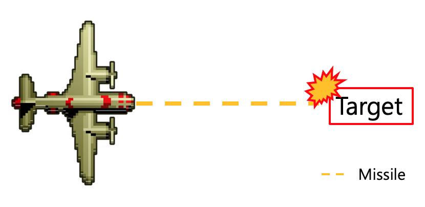
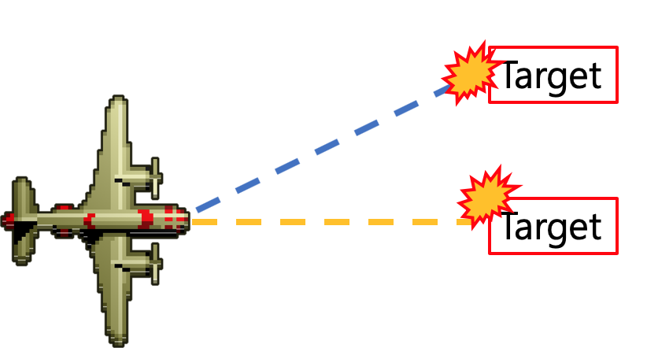
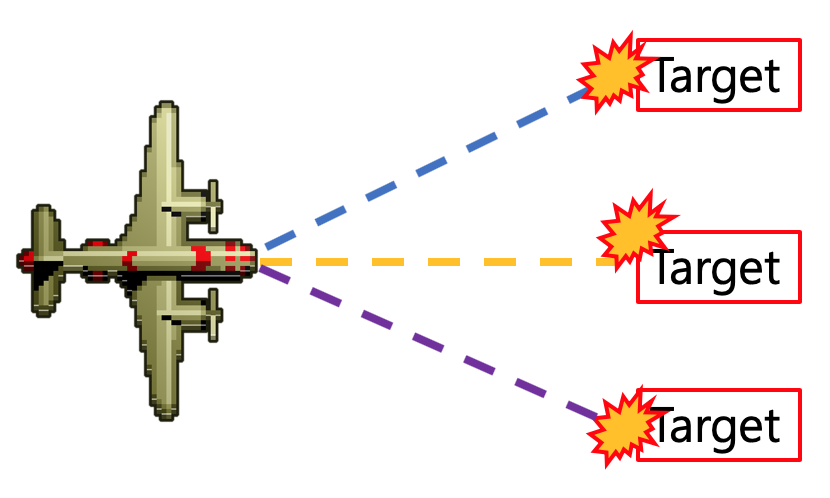
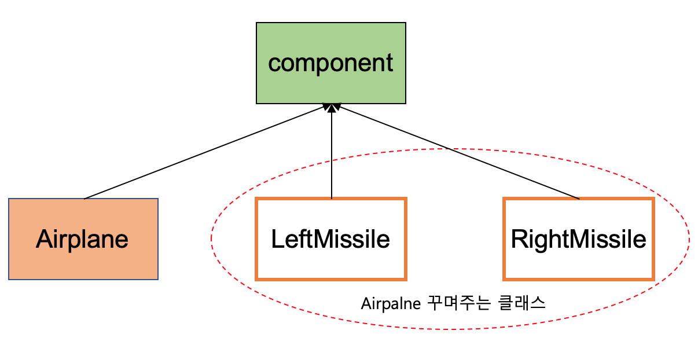
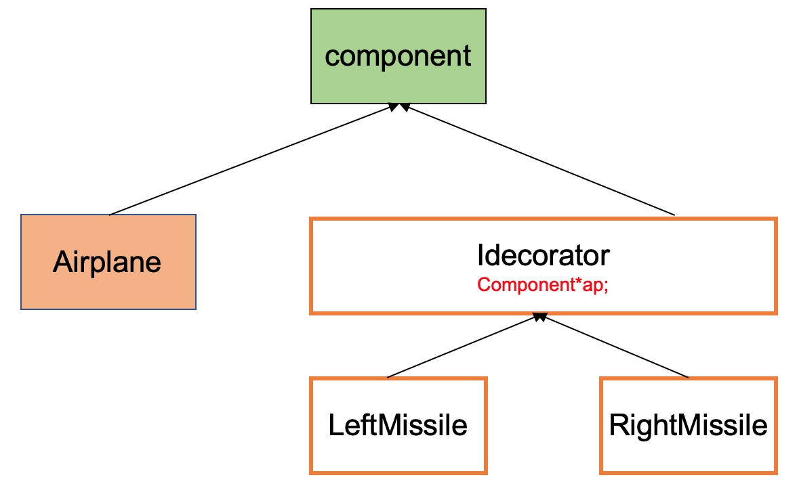

### Intro
Decorator pattern을 이용해 추억의 1942 게임을 간단하게 구현해보자.

### Console 구현
추억의 1942 게임을 기억하는가?

{: width="450" .center-image }

위 사진과 같이, 비행기가 상하좌우로 움직이면서 미사일로 적을 공격해 무찌르는 게임이다.
콘솔로 구현을 했다고 가정을 해보자.

```c
#include <iostream>
using namespace std;

class Airplane
{
  int color;
  int speed;
public:
  void Fire() { cout << "air plane ----- target " << endl; }
};

int main()
{
  Airplane ap;
  ap.Fire();
}
```

위의 코드와 같이 콘솔로서 구현을 간단하게 해볼 수 있다.
만약 비행기를 조종하다가 좋은 아이템을 발견해 총알이 한발 더 나갈 수 있다고 한다면 어떻게 구현해야할 것인가?
우리가 이전에 배웠던, State pattern을 이용하면 구현할 수 있을까? NoNO..

State pattern을 이용하면 상태를 바꿀 수 있지만, 지금과 같은 경우 아이템이 하나가 더 추가 되는 것이기 때문에 state pattern을 이용할 수 없다. 즉, 기존의 동작은 유지하고 하나를 더 추가해야한다.

아래의 사진과 같이 정의하기 위해서는 어떻게 구현해야할까?

{: width="450" .center-image }

### 동작 추가 기능 (상속 이용)
기능을 추가하는 것에 대해 가장 쉽게 생각할 수 있는 기능은 ***상속*** 이다.
만약 왼쪽 미사일을 추가로 발생할 수 있는 아이템을 장착했다고 코드를 구현해보자.

```c
class LeftMissile : public Airplane
{
public:
  void Fire()
  {
    Airplane::Fire(); // 기존의 미사일은 유지
    cout << "Left Missile >>>>>>>> Target " << endl;
  }
};

// main 문에 추가
LeftMissle lm;
lm.Fire();
```

위의 코드는 비행기클래스를 상속받아 기존의 미사일을 발사한 후 왼쪽 미사일 기능을 추가한 클래스이다. 
main문에 추가된 코드를 보면, 우리는 왼쪽미사일을 사용하기 위해 하나의 객체를 새로 만들어야한다. 이후 그 객체를 이용해 미사일을 사용한다. 잘 동작하는 코드 같지만, 생각해보면 우리가 원하는 방향과 다른 코드라는 것을 알 수 있다. 우리는 기존의 비행기에 왼쪽 미사일 발사 아이템을 장착하는 것을 원했지만, 지금과 같이 main문에 새로운 미사일 장착하는 비행기를 만드는 것을 원한 것이아니다. 따라서, 상속을 받는 것은 우리가 원하는 코드 작성이 아니라는 것을 알 수 있다.

정리해보자면, 우리는 상속을 받을 경우 기능을 추가한 객체를 만든 다는 것을 알게 됐다. 즉, 우리는 코드가 수행 중일 때, 아이템이 추가되는 것이 아닌 코드를 만들 때부터 적용된 새로운 객체를 만든 것이다. 이건 우리가 원하는 방향이 아니라는 것을 알 수 있었다.

그렇다면, 어떻게 구현해야할까?

### 동작 기능 추가 (componenet)
시스템 조작이 가능한 클래스를 componenet라고 한다.

리가 동적으로 기능을 추가하기 위해서는 component를 활용하면 만들 수 있다. 즉, 컴파일 타임에 기능을 추가해 새로운 객체를 만드는 것이 아닌, 실행시간에 만드는 기능을 추가하는 방법에는 component를 활용하면 된다.

```c
class LeftMissile
{
   Airplane* ar; // pointer가 핵심이다.
public:
  LeftMissile( Airplane* p) : ar(p) {}
  void Fire()
  {
    ar -> Fire();
    cout << "Left Missile >>>>>>>> Target " << endl;
  }
};

// main 문 추가
LeftMissile lm(&ap); // 새로운 객체를 추가하는 것은 아니다.
lm -> Fire();
```

위와같이 소스코드를 작성하게 된다면, 실행시간에 기능을 추가할 수 있다. 위 코드에서 중요한 점은 LeftMissile에서 객체를 포인터로 가지고 있다는 것이다. 즉, 우리가 기존에 만든 객체를 넘겨 포인터로 가리키게 한 이후 기능을 추가하는 것과 같이 구현했다.

***중요한 점***
기능 추가방법
- 상속 = 클래스에 기능 추가 후 새로운 객체 생성
  - 경직되고 유연성이 다소 부족함
- 구성 = 객체에 기능을 추가, 새로운 객체 미생성
  - 유연하게 변경가능

<mark> 상속이 나쁘다는 것은 아님. 적절히 사용 필요 </mark>

---

왼쪽 미사일 기능을 추가하는 것을 구현해보았다. 그렇다면, 아래와 같이 오른쪽 기능도 추가된 클래스를 구현하기 위해서는 어떻게 해야하는가? 한번 구현해보자.

```c
class RightMissile : public 
  Airplane* ar; // pointer가 핵심이다.
public:
  RightMissile( Airplane* p) : ar(p) {}
  void Fire()
  {
    ar -> Fire();
    cout << "Right Missile >>>>>>>> Target " << endl;
  }
};
```

위와같이, 왼쪽 미사일 발사와 동일하게 작성할 수 있다. 다만, 위와 같이 소스코드를 작성한다면, 아래와 그림과 같은 왼쪽 오른쪽 미사일 동시 발사하는 동작을 구현할 수 없다.

{: width="450" .center-image }

즉, 비행기 왼쪽 미사일 발사기능을 추가한 객체에 오른쪽 기능을 추가할 수 있어야한다. 즉, 코드로 하자면 아래와 같다.

```c
int main()
{
  Airplan ap;
  LeftMissile la(&ap);
  
  RightMissile ra(&la); // 이게 가능해야함. 지금은 컴파일 에러 발생.
}
```

위의 실행문이 수행되어야 코드가 정상적으로 동작한다. 다만, 위의 코드는 작성해도 정상적으로 동작이 되지 않는다. RightMissile은 LeftMissile을 받을 수 없으며 오직 Airplane 객체만 받을 수 있다. 이를 해결학기 위해서는 우리가 늘 주장해왔던 <mark> Upstream 개념 </mark> 이 필요하다. 

Upstream 개념을 적용해보면, 비행기와 비행기를 꾸며주는 (왼쪽, 오른쪽 미사일) 클래는 공통의 기반클래스를 가지고 있어야 한다.

{:width="430" :height="300" .center-image } 

위와 같은 디자인 패턴을 구성해 만들면, RightMissile 기능을 추가해 동시해 발사가 가능하다.

```c
struct component
{
  virtual void Fire() = 0;
  virtual ~Component();
};

// Right, Left 부분 Missile 추가 하는 부분에 Airplan *가 아닌 Componenet*로 받을 것. 즉, 공통의 기반 클래스를 이용해 전달받을 것
```

### More Extension
위의 내용을 조금 더 발전시켜보자.

Right, Left missile 기능을 추가하는 부분에서 component 포인터 (공통의 기반 클래스)로 전달받아 기능을 추가하는 것까지 확인하였다. 우리가 보통 공통적인 부분은 의존성을 최소화 하기 위해 공통의 기반 클래스로 만든 다는 것을 알고 있다. 이부분을 적용해 아래와 같이 패턴을 정리할 수 있다. 즉, Right, Left 미사일 기능에 들어가는 Component 포인터 부분을 상위로 뺀 후 코드를 작성하는게 더 좋다.

{:width="430" :height="300" .center-image } 

위의 패턴을 ***Decorator Pattern*** 이라고 부른다. 즉, 주 사용 클래스가 존재하고 주변에 꾸며주는 클래스가 존재하는 패턴을 말한다.

<mark>패턴의 의도</mark>
  - 객체에 동적인 기능 추가
  - 기능 추가를 위해 서브클래스를 사용하는 것 보다 융통성있는 방법을 제공

***최종 코드 위치*** : [Decorator Pattern 소스코드](https://github.com/nerdooit/code_practice/blob/master/Lecture/Design_Pattern/decorator.cc)
