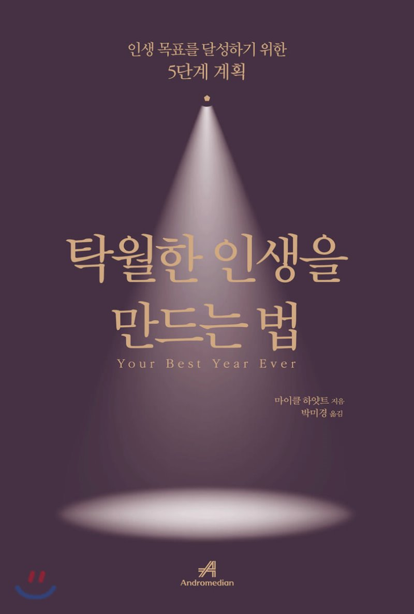

### 탁월한 인생을 만드는 법
탁월한 인생을 만드는 법이라는 책은 체인지 그라운드에서 추천하길래 고른 책이다. 신년이 다가오기도 하고, 새로운 마음으로 자극을 받고 싶어서 읽게 되었다. 우선, 좋았던 점은 방법론과 실험들을 같이 제시한 점들이 좋았던 것 같다. 다만, 너무 많은 내용을 담으려 해서 조금 얕은 느낌도 없지 않다. 책 내용 중 우리는 어떤 방법론을 바꿔야한다고 주장하지만 그게 아닌 시스템을 바꿔야한다는 부분인 인상 깊었다. 예를 들면, 우리는 내일 일찍 일어나서 어떤 일을 해서 우리를 좀 더 성장하도록 해야지 한다. 하지만 실패할 경우가 부지기수라는 건 많이 공감할 것이다. 그 이유가 일찍 일어나는게 힘든 것이 아닌 전체적인 시스템이 일찍일어나는데 힘든 구조로 되어져 있다라는 점이다. 일찍 일어나기 위해서는 빨리 자야하고 빨리 자기 위해선 커피를 마시지 말아야하고 등등을 이야기한다. 결론은 메타인지를 높여 자신을 객관해서 생각해야한다는 말인 것 같다. SMART 기법에 대해 설명하고 저자는 더 나아가 SMARTER System을 개발했다고 했다. 이 부분은 인상깊었다기 보다 그냥 목표를 최대한 구체적으로 명확하게 해야한다는 점이 많이 생각났다. 본인은 새로운 관점을 갖는걸 좋아하는데 위기라는 부분에 대해 되게 긍정적으로 서술한 부분과 감사한 마음으로 세상을 바라보는 관점에 대해 서술한 부분이 공감가고 배울 수 있어서 좋았던 것 같다.

### 책을 읽고 좋았던 점
- 구체적으로 계획을 나누어 작성할 것.
 - 언뜻 보면 당연한 이야기 같다. 하지만, 책에서는 직접 어떤 식으로 계획을 작성하였는지 보여주고 이렇게 하면 좋을 것 같다 하는 템플릿도 제공해줘서 좋았다. 특히, 계획을 작성할 때, 어떤 성과 위주의 계획이 아닌 일상 전반적인 부분에 대해서 계획을 세우는 부분이 인상깊었다. 예를 들어, 우리는 보통 공부를 어떤 방식으로 하겠다. 혹은 올 해 어떤 걸 이루겠다 식의 계획을 많이 작성한다. 책에서는 직장, 연애, 공부, 성공, 체력 이런식으로 카테고리를 나누고 세분화 목록을 3가지 정도로 적어서 구체화했다. 여기서 좀 주목할 점이 있는데, 연애에 대해서도 성장관점으로 바라 본 점이다. 보통 연애는 그냥 잘해주면 된다고 생각하지만, 책에서는 구체적으로 어떻게 잘해줄 것인지 명확하게 서술한 점이 인상 깊었다.

 - 트리거
  - 어떤 습관을 들이기 위해 트리거가 될 만한 요소를 가미해야하는 부분이 좋았다. 넛지라는 개념으로 많이 알려져있지만, 책에서도 트리거와 비슷한 개념으로 등장했다. 우리가 운동을 하기 위해서 운동을 해야한다라는 계획보다는 운동을 할 수 있는 사소한 트리거를 두면 훨씬 효과적이라는 것이다. 예를들면, 우리가 아침에 일어나 운동을 하고자 한다. 그럴 경우 잠에 들기전 요가메트나 아령을 가까이에 두고 잔다. 이후 일어나면 운동할 확률이 더 높아진다고 알려져있다. 이런 방법을 이용하면 인생을 좀 더 나은 방향으로 설계할 수 있을 것 같다는 생각이 들었다.

{: width="130" height="220" .center-image}
