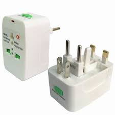

### Intro.
객체 지향에서 사용하는 Adaptor 개념에 대해 알아보자.

### 도형 편집기
필요시에 간단하게 도형을 그릴 수 있는 도형 편집기를 콘솔에 구현해보자.

```c
class Shape
{
public:
  virtual void Draw() { cout << "Draw Shape.. " << endl; }
};

class Rect : public Shape
{
public:
  virtual void Draw() { cout << "Draw Rect.. " << endl; }
};

class Circle : public Shape
{
public:
  virtual void Draw() { cout << "Draw Circle.. " << endl; }
};

int main()
{
  vector<Shape*> v;
  v.push_back(new Rect);
  v.push_back(new Circle);

  for (auto p : v)
    p->Draw();
}
```

만약, 위의 도형편집기 코드에서 글자를 그리는? 출력하는 부분을 넣고 싶다고 가정해보자. 그럴경우 어떻게 해야하는가?

1. Shape를 상속받는 Text class를 하나 생성한다.
2. Draw를 통해 Text를 그려준다.

두 가지 방법을 이용하면 Text 클래스도 쉽게 만들 수 있으며, 우리는 vector에 넣은 후 글자도 출력할 수 있다.

<mark>이전 소스코드</mark> 중 내가 정말 잘 만들었던 TextView 코드가 아래와 같이 있다고 가정해보자. (잘 만들었다기 보다.. 귀찮아서 가져다 쓰는걸로.) 이 경우에 TextView 클래스를 가져다 쓰려면 어떻게 해야할까?

```c
class TextView
{
  string font;
  string data;
  int    width;

public:
  TextView(string fo = "Arials", string d, int w = 24) 
    : font(fo), data(d), width(w) {}

  void Show() { cout << data << endl; }
};
```

### Adaptor
우리는 기존의 코드 (TextView 클래스)를 추가하기 위해서는 어떻게 해야할까? ***Adaptor*** 를 활용하면 된다.

Adaptor란?


위의 그림과 같이, adaptor는 우리가 여행갈때 흔히 사용하는 제품을 뜻한다. Adaptor 같은 경우 기존에 사용하던 기능은 사용하되 외부적으로 필요한 인터페이스를 제공해주는 것이다. 즉, 우리가 220v를 디폴트로 사용하는데 가까운 일본에 놀러가게 된다면, 110v로 변경해서 사용한다. 이때 사용하는 것이 Adaptor 이다.

위 개념을 코드에 가져와 생각해보면, TextView 클래스를 현재 사용하고 있는 도형 편집기로 가져와서 사용하면 된다.

```c
#include "TextView.h" // TextView class 추가

class Text : public TextView, public Shape
{
  Text(string str) : TextView(str)
  virtual void Draw() { TextView::Show(); }
};

int main()
{
  vector<Shape*> v;
  v.push_back(new Text("Hello"));
}
```

위의 코드를 본다면, Draw 함수 내에서 새로 어떤 기능을 구현한 것이아니라 TextView class 내 존재하는 Show()를 이용해 출력하는 것을 볼 수 있다. 이 방법을 우리는 Adaptor를 사용한다고 한다.

### Adaptor 종류 (class adaptor, object adaptor)
우리는 Text 클래스를 구현할 떄, TextView라는 클래스를 Adaptor로 사용했다.

```c
int main()
{
  vector<Shape*> v;
  // v.push_back(new Text("Hello"));

  Text tv("Hello");
  v.push_back(&tv); // 이 코드가 사용가능할까?
}
```

위의 코드를 생각해보자.

***v.push_back(&tv)*** 의 코드가 사용가능할까? 안된다. vector의 template인자로 Shape 형태만 받을 수 있기 떄문에 연관이 없는 TextView 객체는 전달받을 수 없기 떄문이다. 따라서, TextView 객체를 전달받기 위해서는 vector의 인터페이스를 변경해야한다.
