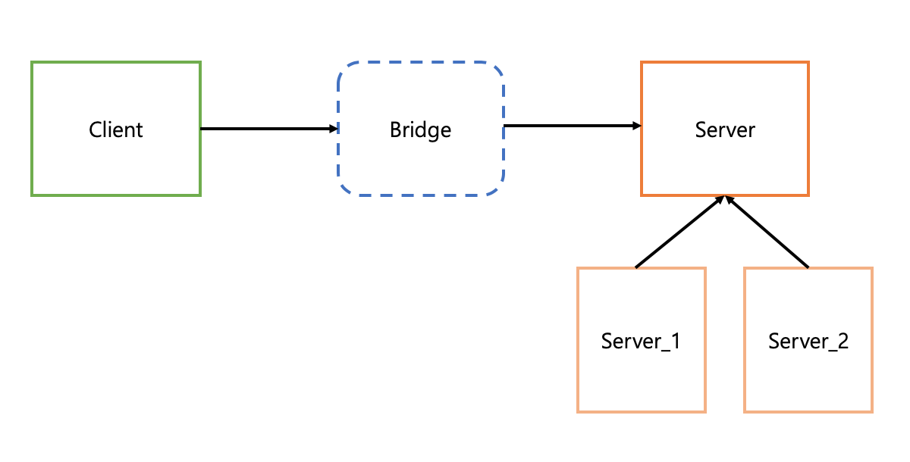

### Intro.
객체 지향에서 Bridge Pattern에 대해 알아보자.

### Bridge Pattern이란?
Bridge pattern 이란 구현부와 추상화 개념을 분리해서 각각의 독립적으로 변경할 수 있게 한다.



위의 그림과 같이 클래스들이 구현되는 패턴을 <mark>Bridge Pattern</mark> 이라고한다.

### MP3 example
아래의 예시를 통해 Bridge pattern에 대해 알아보자.

```c
class IPod
{
public:
  void Play() { cout << "MP3 play.." << endl; }
  void Stop() { cout << "MP3 stop.." << endl; }
};

class People
{
public:
  void useMP3(IPod* mp)
  {
    mp->Play();
  }
};
```

위의 코드를 보면, Ipod이라는 mp3를 사람이 전달받아 사용하는 단순한 기능을 가진 클래스들이다. 코드를 봤을 때 별 문제가 없어 보인다. 하지만, 우리가 IPod이 아닌 샤오미 혹은 samsung 제품을 사용하고 싶다면 어떻게 해야할까? 사용이 안되지 않는다. 이를 위해서 함수를 고치는 방법이 있는데, 그럴 경우 People의 코드가 바껴야하고 신제품이 나올때 마다 코드를 변경해야한다. 이 문제는 우리가 늘 경험해왔고 이를 해결하기 위해서 Upstream 개념을 적용해 Interface를 구현해 해결한다는 것을 배웠었다.

```c
strcut IMP3
{
  virtual void Play() = 0;
  virtual void Stop() = 0;
  virtual ~IMP3() {}
};

class IPod : public IMP3
{
public:
  virtual void Play() { cout << "IPod play.." << endl; }
  virtual void Stop() { cout << "IPod Stop.." << endl; }
};

class People
{
  void useMP3(IMP3* mp) // mp3 종류와 상관없이 모든 것을 받을 수 있다.
  {
    mp->Play();
  }
};
```

위와 같은 Interface를 구현하고 MP3를 만드는 제조업체들은 위 interface를 상속받아 꼭 구현해야하는 부분을 구현한 후 제품을 판매하면 해결된다. 하지만, 조금 더 들어가서 생각해보자. 어떤 한 사람이 1분 미리듣기 기능을 원해 요청을 했다. 그럴 경우 interface 전체를 바꿔야할까? 요구 하는 한 사람 때문에 모든 mp3에 1분 미리듣기 기능을 추가하는 건 너무 비효율 적이다.

```c
struct IMP3
{
  virtual void Play() = 0;
  virtual void Stop() = 0;
  virtual void OneMinuate() = 0; // ? 여기를 인터페이스에 추가하는 것이 맞는 것일까?
}
```

요구사항에 의해 기능을 담당하는 부분이 계속해서 변하는 것은 좋지 않다. 즉, 요구하는 주체와 구현 기능을 담당하는 부분과 직접적인 연결을 통해 지속적인 변화에 대응 하는 방법 보다는 중간에 처리하는 관리자를 두는 방법을 이용한다. 중간 관리자를 둘 경우 변화할 때 발생하는 overhead를 줄이고 유연하게 대처 가능하며, 이를 우리는 <mark> bridge pattern </mark> 이라 칭한다.


