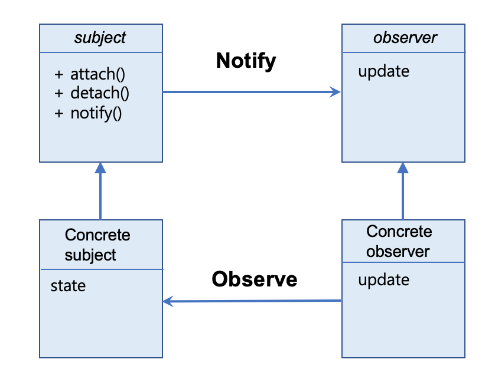

### Intro.
하나의 데이터를 변경할 경우 연결된 다양한 객체를 변경하는  Observer pattern에 대해 알아보자.

#### Observer Pattern란
> 객체사이의 1:N의 종속성을 정의하고 하나의 객체로 인해 N개의 종속적인 객체에 통보가 가고 자동적으로 갱신되는 패턴을 "Observer pattern" 이라한다.

위의 개념에서 알 수 있듯 변경에 대한 통보로 인해 연관된 객체의 갱신하는 디자인을 Observer pattern이라 말한다.

간단한 예제를 생각해보자.

{: width="550" height="450" .center-image}

위의 그림은 우리가 흔히 쓰는 excel 예시를 가져온 것이다. 우리가 excel에서 데이터를 적은 후 시각화하길 원할 때, 삽입 버튼을 누른 후 막대, 원형 등과 같인 그래프를 이용한다. 만약 데이터를 변경할 경우 그래프가 자동적으로 바뀌는 것을 본 적 있을 것이다. 이런 상황을 observer pattern을 이용해 design 되었다 라고 생각하면 된다.

그렇다면 어떻게 해야 데이터를 업데이트 할 경우 모든 그래프가 바뀌게 될 것인가? 우리는 두 가지 방법을 생각해 볼 수 있다.

1. 모든 Graph들이 table의 데이터를 바라보고 있을 경우.
  - 이 경우는 Graph들이 loop를 돌면서, 테이블의 데이터 바뀌는지 유무를 실시간으로 체크해야한다. 만약, 그래프가 수 만개가 된다면? overhead가 너무 커질 수 있다.

2. table이 변경된 후 즉시 Graph들에 통보할 경우.
  - 이 경우는 table에서 Graph를 가리키는 포인터들을 가지고 있으며, 어떤 데이터의 변화가 발생할 경우 모든 Graph에 통보하면 된다.
  - Obsever pattern에서는 이 방법을 사용한다.
    - Graph 같은 객체들을 Observer라고 칭함.
    - Table 같은 객체를 Subject 라고 칭함.

간단하게 excel과 같은 예시를 만들면서 observer pattern을 적용시켜보자.

아래의 코드는 단순한 excel 콘솔 스켈레톤 코드이다.

```c
class Table
{
  int data;
public:
  void SetData(int n) {
    data =n;
  }
};

class PieGraph
{
public:
  void Draw(int n)
  {
    cout << "Pie Graph";
    for (int i = 0; i < n; i++)
      cout << "*";
    cout << endl;
  }
};

class BarGraph
{
public:
  void Draw(int n)
  {
    cout << "Bar Graph";
    for (int i = 0; i < n; i++)
      cout << "+";
    cout << endl;
  }
};
```

#### Simple Obeserver Pattern
단순한 Observer pattern을 이용해 소스코드를 변경해보자.

Table에 데이터가 변경될 경우 Graph들에 "애들아!! 나 지금 데이터 변경 됐어" 라고 알려주면 된다. 그렇다면, Table에서는 Grpah들을 모두 가지고 있어야한다. 이런 Graph들을 관리해 줄 Container가 필요하고 여기서는 vector를 이용할 것이다. Vector를 이용할 경우 어떤 데이터 타입으로 받을 것인가? PieGraph ? BarGraph? 이렇게 받을 경우 특정 Graph만 전달 받을 수 있어서 상위 계층을 만들어야한다. 즉 Upstream을 이용할 수 있는 interface를 구축해야한다.

```c
struct IGraph
{
  virtual void update(int) = 0;

  virtual ~IGraph() {}
};
```

우리는 Table에서 IGraph 인터페이스를 이용해 각 종 그래프들의 정보를 알 수 있다. 단, 모든 Graph는 IGraph를 상속받아 생성해야하는 rule을 정한다.

구조화 시켜 그림을 그려보면 다음과 같다.
{: .center-image width="550" }

위의 구조화 그림과 같이, Table을 생성한 후 Graph를 생성할 경우 Table에 등록을 해준다. 이후 table의 data가 갱신될 경우 Update함수를 이용해 갱신된 그래프를 그려주도록 한다.

[Simple ObserverPattern 완성된 코드](https://github.com/nerdooit/code_practice/blob/master/Lecture/Design_Pattern/practice/simple_observer.cc)

### Observer Design pattern
Simple 했던 이전의 Observer pattern의 기능을 좀 더 확장시켜보자.

Table 클래스에 초점을 맞추고 생각해보자.
기존의 테이블 같은 경우 int 타입의 data만 다뤘으며, 업데이트 할 경우도 별 문제가 되지 않았다. 만약 data 변경을 많이 해야할 경우는 어떨까?

```c
class Table3D
{
  vector<IGraph*> v;
  int data[10];
public:
  void attach(IGraph* p) { v.push_back(p); }
  void detach()          { v.pop_back(); }

  void SetData(int arr[], int sz) {

    for (int i = 0; i < sz; i++)
    {
      data[i] = arr[i];

      for (auto p : v)
        p->update(data[i]);
    }
  }
};
```

여러개의 데이터를 담는 케이스가 필요해 우리는 클래스를 하나 더 만들었다. Tabel3D 같은 경우 데이터를 여러개 저장할 수 있는 멤버변수를 가지고 있으며, 전달받은 데이터를 저장하는 부분이 약간 복잡해진 케이스다.

우리가 이전에 구현했던 Table 클래스를 보고 어느 부분이 변경되었는지 확인해보자.

```c
class Table
{
  vector<IGraph*> v;
  int data;
public:
  void attach(IGraph* p) { v.push_back(p); }
  void detach()          { v.pop_back(); }

  void setData(int n)
  {
    data = n;

    for (auto p : v)
      p->update(data);
  }
};
```

우리가 처음에 구현한 Table 클래스이다. Table3D 부분과 비교해서 어느 부분이 변경되었는가? Data 부분이 복잡해지고 Data를 저장하는 setData 부분이 복잡해진 것을 우리는 알 수 있다. 이 부분을 보고 유추해볼 수 있는 것이 데이터를 담당하는 부분과 관찰하는 기능부분을 분리해서 생각해 낼 수 있다는 점이다.

> 데이터가 다양해져 복잡해질 경우, 데이터 담당하는 부분만 변한다. 관찰하는 기능은 변하지 않는다.

Table 기준, 데이터 담당부분
- data
- setData(int n)

관찰을 담당부분 (모든 클래스)
- vector<IGraph*>
- attach
- detach
- setData 함수 내 존재하는 update를 하는 loop문을 우리는 생각할 수 있다. (notify 부분이라고 함)

위와 같이 관찰을 담당하는 부분은 모든 클래스에서 공통적으로 사용하기 때문에 하나의 기반클래스로 묶는 것이 유지보수에 좋다. 보통 이런 기반클래스를 GoF 디자인 패턴에서는 Subject라고 부른다.

```c
class Subject
{
public:
  vector<IGraph*> v;
  void attach(IGraph* p) { v.push_back(p); }
  void detach()          { v.pop_back(); }
  void notify(int data)
  {
    for (auto p : v)
      p->update(data);
  }
};

class Table : public Subject
{
  int data;
public:

  void SetData(int d) {
    data = d;
    notify(data);
  }
};

class Table3D : public Subject
{
  // 위 함수에서 데이터부분만 가져옴 됨 (동일함)
};
```

### GoF의 Observer pattern
우리는 엑셀 기능을 기반으로 observer pattern을 살펴보았다. GoF의 디자인 패턴에서 말하는 Observer pattern을 이용해 정리해보자.

GoF Observer pattern
> 객체 사이의 1:N의 종속성을 정의하고 한 객체의 상태가 변하면 종속된 다른 객체에 통보가 가고 자동으로 수정이 일어나게 한다.

객체의 상태가 변해 통보하는 객체 - Subject 객체
수정이 발생하는 객체 - Observer 객체

위의 용어를 잘 이해해야 한다.



위의 그림은 GoF의 디자인 패턴에서 나오는 다이어그램은 모사한 것이다. 우리가 지금까지 skeleton 코드를 가지고 구현을 하면서 봤던 것들을 도식화 시킨 것이다.

여기서 중요하게 봐야하는 점은 두 가지가 존재한다.
1. Notify를 할 경우 Interface와 통신을 한다는 점이다.
2. Observe 하는 부분 즉, Observer 객체에서 update가 완료된 후 Subject객체에 알려주는 기능이 아직 구현되지 않았다.

[simple observer pattern 소스](https://github.com/nerdooit/code_practice/blob/master/Lecture/Design_Pattern/practice/simple_observer2.cc)

### Observe 기능
우리는 notify함수를 통해 값이 변경되었다 라는 것을 통보하였다. 여기서 생각해 볼 것이 값이 변경된 것만 통보하면 되는 것이 아닌 값이 어떻게 변경되었는지를 통보해야한다.

변경된 값을 어떻게 통보할 것 인가?

1. 변화를 통보할 때 같이 전달 - push  방식
  - 우리가 이전에 구현한 방식과 동일하다. 우리는 변경될 경우 data를 전달하였다. 하지만, data 값이 다양해 여러개의 데이터를 보내야할 경우 전달이 어려울 수 있다.

2. 변화 되었다는 사실만 전달하고, Observer 객체에서 Subject의 멤버 함수를 통해 데이터를 얻어오면 됨. - pull 방식
  - 값을 넘기는 것이 아닌 Subject 객체의 주소를 전달하여, object 객체에서 그냥 데이터를 얻어오도록 함.

데이터를 전달하는 방식을 push 방식에서 pull 방식으로 변경해보자.

```c
struct IGraph
{
  virtual void update(Subject* p) = 0;
  virtual ~IGraph() {}
};

class Subject
{
public:
  ...
  void notify()
  {
    for (auto p : v)
      p->update(this);
  }
};

class Table : public Subject
{
public:
  ...
  int getData() { return data; }
};

class BarGraph : public IGraph
{
public:
  virtual void update(Subject* p)
  {
    int n = p->getData();
    Draw(n);
  }
};
```

pull 방식으로 데이터를 얻기 위해서는 subject 관련 객체의 주소를 전달해야한다. 주소를 전달받아 getData()를 이용해서 데이터를 얻어온다. 만약 얻어와야하는 데이터가 여러가지라면 getter를 멤버데이터 만큼 만들어 사용하면 된다. 다른 방법으로 전달이 가능하겠지만, 우선 주소를 알면 데이터에 접근할 수 있다는 것이 핵심이다.

위의 코드가 잘 돌아갈 것인가?
2가지의 에러를 직면할 것이다.

1. Subject 클래스가 없어서 발생하는 error
2. Subject 클래스내에 getData가 없다는 error


첫 번째 에러를 해결하기 위해서는 ***전방선언***  이 필요하다. IGraph내 update함수에서 인자로 subject포인터를 전달받지만, IGraph클래스 전에 Subject가 선언되어있지않아 발생하는 error이다. 따라서, pointer 선언이 가능한 전방선언을 통해 에러를 해결할 수 있다.

두 번째 에러를 해결하기 위해서는 Subject를 update 인자로 전달받지않고 getData함수를 가지고 있는 Table을 인자로 받으면 된다. 하지만, 이렇게 Table로 할 경우 Table3D와 같은 다른 Table에서는 데이터를 얻어올 수 없다. 즉, upstream이 필요하다는 것이며 Subject는 건들면 안되는 것이다. 이를 해결하기 위해서는 static_cast<Table*> 이라는 것을 이용해 casting이 필요하다.

### 정리
우리는 지금까지 observer pattern에 대해 알아보았다. GoF의 디자인 패턴에서 나오는 다이어그램과 정의 및 어떤 상황에서 필요한지 기억할 필요가 있다. 특히, 마지막 Pull 방식으로 변경할 때 발생하는 에러를 해결하는 방법들에 대해 유심하게 보고 open source에서 어떻게 사용하고 있는지 확인하면 좋을 것 같다.

[최종 소스코드](https://github.com/nerdooit/code_practice/blob/master/Lecture/Design_Pattern/practice/simple_observer3.cc)
