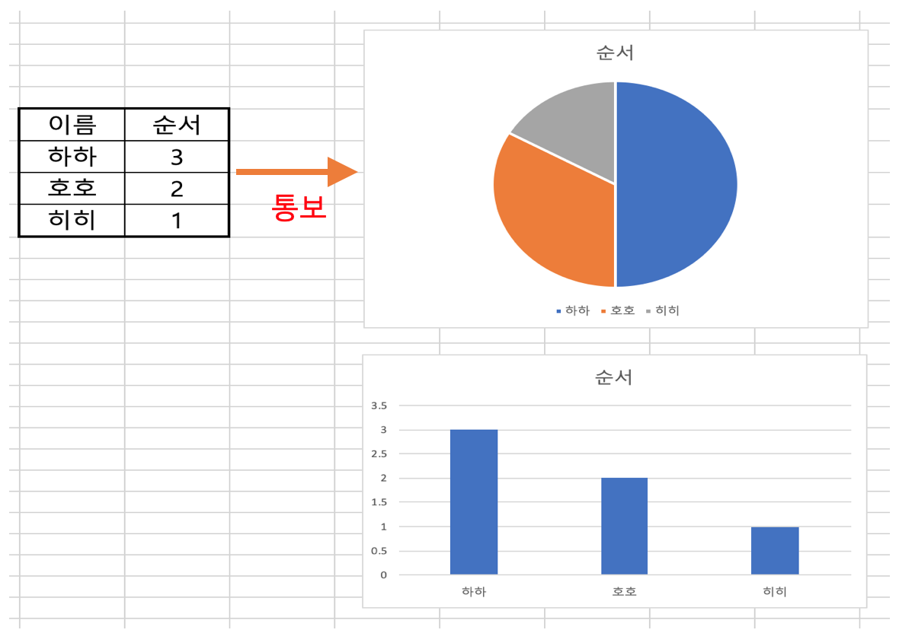
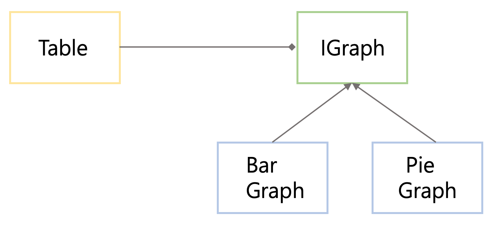

### Intro.
하나의 데이터를 변경할 경우 연결된 다양한 객체를 변경하는  Observer pattern에 대해 알아보자.

#### Observer Pattern란
> 객체사이의 1:N의 종속성을 정의하고 하나의 객체로 인해 N개의 종속적인 객체에 통보가 가고 자동적으로 갱신되는 패턴을 "Observer pattern" 이라한다.

위의 개념에서 알 수 있듯 변경에 대한 통보로 인해 연관된 객체의 갱신하는 디자인을 Observer pattern이라 말한다.

간단한 예제를 생각해보자.

{: width="550" height="450" .center-image}

위의 그림은 우리가 흔히 쓰는 excel 예시를 가져온 것이다. 우리가 excel에서 데이터를 적은 후 시각화하길 원할 때, 삽입 버튼을 누른 후 막대, 원형 등과 같인 그래프를 이용한다. 만약 데이터를 변경할 경우 그래프가 자동적으로 바뀌는 것을 본 적 있을 것이다. 이런 상황을 observer pattern을 이용해 design 되었다 라고 생각하면 된다.

그렇다면 어떻게 해야 데이터를 업데이트 할 경우 모든 그래프가 바뀌게 될 것인가? 우리는 두 가지 방법을 생각해 볼 수 있다.

1. 모든 Graph들이 table의 데이터를 바라보고 있을 경우.
  - 이 경우는 Graph들이 loop를 돌면서, 테이블의 데이터 바뀌는지 유무를 실시간으로 체크해야한다. 만약, 그래프가 수 만개가 된다면? overhead가 너무 커질 수 있다.

2. table이 변경된 후 즉시 Graph들에 통보할 경우.
  - 이 경우는 table에서 Graph를 가리키는 포인터들을 가지고 있으며, 어떤 데이터의 변화가 발생할 경우 모든 Graph에 통보하면 된다.
  - Obsever pattern에서는 이 방법을 사용한다.
    - Graph 같은 객체들을 Observer라고 칭함.
    - Table 같은 객체를 Subject 라고 칭함.

간단하게 excel과 같은 예시를 만들면서 observer pattern을 적용시켜보자.

아래의 코드는 단순한 excel 콘솔 스켈레톤 코드이다.

```c
class Table
{
  int data;
public:
  void SetData(int n) {
    data =n;
  }
};

class PieGraph
{
public:
  void Draw(int n)
  {
    cout << "Pie Graph";
    for (int i = 0; i < n; i++)
      cout << "*";
    cout << endl;
  }
};

class BarGraph
{
public:
  void Draw(int n)
  {
    cout << "Bar Graph";
    for (int i = 0; i < n; i++)
      cout << "+";
    cout << endl;
  }
};
```

#### Simple Obeserver Pattern
단순한 Observer pattern을 이용해 소스코드를 변경해보자.

Table에 데이터가 변경될 경우 Graph들에 "애들아!! 나 지금 데이터 변경 됐어" 라고 알려주면 된다. 그렇다면, Table에서는 Grpah들을 모두 가지고 있어야한다. 이런 Graph들을 관리해 줄 Container가 필요하고 여기서는 vector를 이용할 것이다. Vector를 이용할 경우 어떤 데이터 타입으로 받을 것인가? PieGraph ? BarGraph? 이렇게 받을 경우 특정 Graph만 전달 받을 수 있어서 상위 계층을 만들어야한다. 즉 Upstream을 이용할 수 있는 interface를 구축해야한다.

```c
struct IGraph
{
  virtual void update(int) = 0;

  virtual ~IGraph() {}
};
```

우리는 Table에서 IGraph 인터페이스를 이용해 각 종 그래프들의 정보를 알 수 있다. 단, 모든 Graph는 IGraph를 상속받아 생성해야하는 rule을 정한다.

구조화 시켜 그림을 그려보면 다음과 같다.
{: .center-image}

위의 구조화 그림과 같이, Table을 생성한 후 Graph를 생성할 경우 Table에 등록을 해준다. 이후 table의 data가 갱신될 경우 Update함수를 이용해 갱신된 그래프를 그려주도록 한다.

[Simple ObserverPattern 완성된 코드](https://github.com/nerdooit/code_practice/blob/master/Lecture/Design_Pattern/practice/simple_observer.cc)


