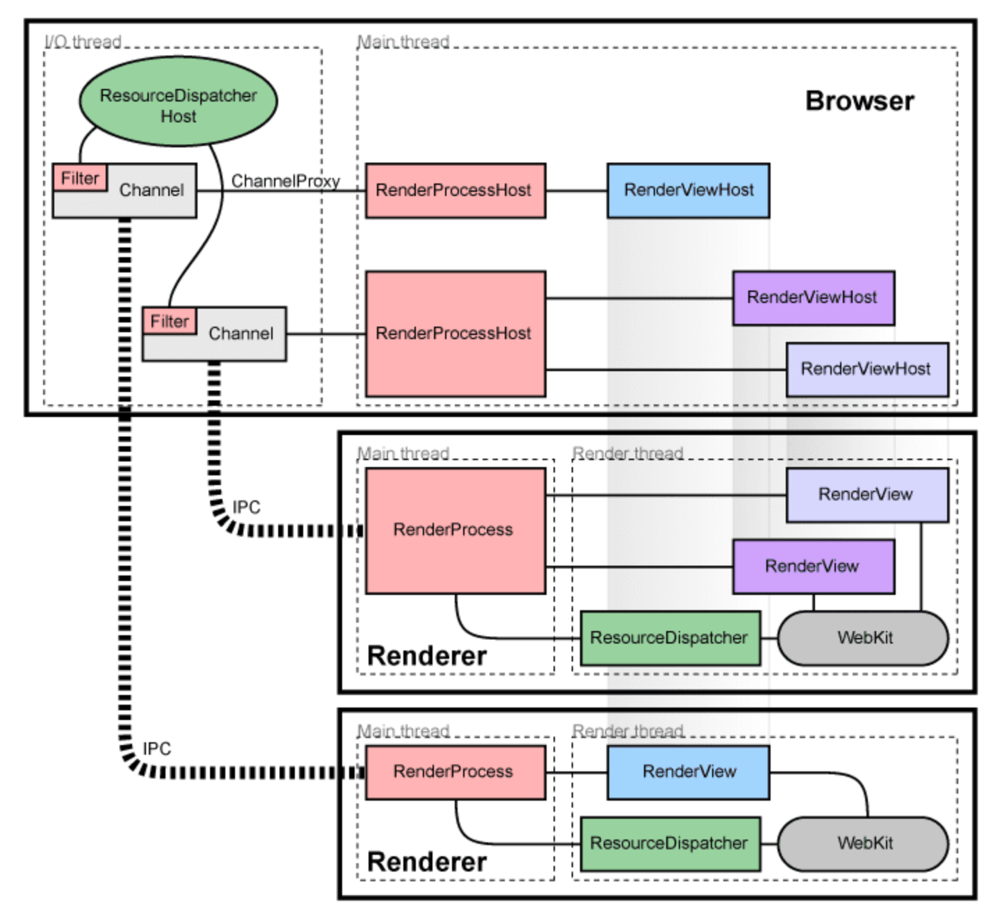

### Intro.
Chromium의 핵심 기법인 Multi process 구조에 대해 알아보자.

문서의 내용이 다소 옛 내용이 많이 포함되어 있지만, 뼈대를 잡기에는 충분하다고 생각한다.
아래의 내용은 chromium 문서 중 [Multi-process Architectue 내용](https://www.chromium.org/developers/design-documents/multi-process-architecture)을 참고한다.

본인이 해석하고 이해한 부분을 기반으로 작성하도록 한다.

#### Problem
Chromium은 2008년에 release 되었으며, 당시 상황에서 multi process의 구조를 도입해야한다고 주장하며 실제 적용하였다.

당시 2006년 정도에 하나의 프로세스에서 다수의 프로그램을 돌리는 모델을 사용하고 있었다. 하지만, 날이 갈수록 Hardware의 스펙은 증가하고 코어수도 늘어나고 있는 상황이였고 Software 적으로는 기능들이 많이 추가되고 컨텐츠의 내용이 비대해지고 있었다. 이 상황에서 단일 프로세스로 브라우저를 동작시키기에는 오동작이 많았고 컨텐츠 내용 중 사소한 버그로 인해 브라우저가 종료되는 문제가 존재했다. 또한 여러개의 탭을 사용해 브라우저를 이용하는데, 하나의 텝에서 문제가 발생할 경우 모든 텝이 다 종료되는 문제도 존재했다.

이런 문제를 해결하기 위해, 하드웨어 성능도 좋아졌기 때문에 브라우저에 대해 다른 모델을 도입할 필요가 있었고 Chromium은 multi process 구조를 도입하게 된다.

#### Architecture overview
프로세스를 하나만 두는 것이 아니라 다수의 프로세스를 두고 브라우저의 텝 별로 프로세스를 두기로 모델을 작성하였다. 사소한 결함이 발생해도 하나의 프로세스만 종료되고 나머지 텝의 프로세스는 정상적으로 동작하게 하는 모델을 구현한 것이다. 프로세스는 상호독립적인 객체 즉, 자신의 메모리영역에는 자신만이 접근 가능하고 다른 프로세스들은 접근하지 못하는 개념을 이용해 하나의 텝에 적용된 프로세스는 다른 프로세스에서 접근하지 못하는 점도 이용하였다.

Process 정리
- Browser process : UI, tab 관리 그리고 plugin process 관리.
- Render process (Renderer) : 텝 별 프로세스를 지칭하며, page rendering 동작을 담당한다.
  - Render process에서 중요한 점은 Renderring engine을 품고 있으며, chromium에서는 <mark> blink </mark>를 이용한다.

그 외에 Graphic process 를 포함해 다른 process들이 많이 존재하나, 이후의 문서에서 차근차근 다루도록 하겠다.

위의 그림은 multi-process 모델을 도식화한 것이다. 최근들어 변화한 부분도 있지만, 골격은 비슷하며 impl-side painting등의 기법들이 추가됐다. 코드로 접근 할 경우 유사하게 달라진 점은 RenderView 의 class까 RenderFrame이라는 class로 변경되었다는 점이다. site isolation문제가 존재하여 바꼈다고 하나, 이 부분도 추후 문서에서 다뤄보도록 하자.

### Sharing the render process
일반적으로, 새로운 window 또는 tab은 새로운 프로세스에서 열린다. Browser process가 요청을 받거나 혹은 필요할 경우 Render process를 생성한다. Render process의 핵심은 RenderView (현재 RenderFrame)이고 프로세스를 하나 생성한 후, RenderView를 만든다. Render process 같은 경우 tab or window를 생성할 때 공유되는 경우들도 있다. 예를 들면, 하나의 WebApp에서 새로운 윈도우를 열지만, 그 윈도우와 동시성이 요구될 때 Render process를 공유하면 효율적이다. (e.g. window.open) 또한, total process가 너무 많아 system 운영이 어려울 경우 render process를 생성해 과부화 시키는 것이 아니라 공유한다.

### Sandboxing the renderer
우리는 위의 내용을 통해 render process가 다수의 프로세스에서 공유 되는 경우들을 확인했다. 프로세스같은 경우 ***상호독립객체*** 임으로 다른 프로세스가 접근하여 데이터를 변경하는 경우가 없어야한다. render process에 접근하는 각각의 프로세스는 독립적으로 운영되는 것이 핵심이다. chromium에서는 sandboxing 을 통해 system 자원들을 보호한다. 구체적으로, render process같은 경우 네트 워크 접근은 오직 브라우저 프로세스를 통해 가능하도록 한다. 더 나아가, 호스트의 운영체제의 접근권한을 이용하여
