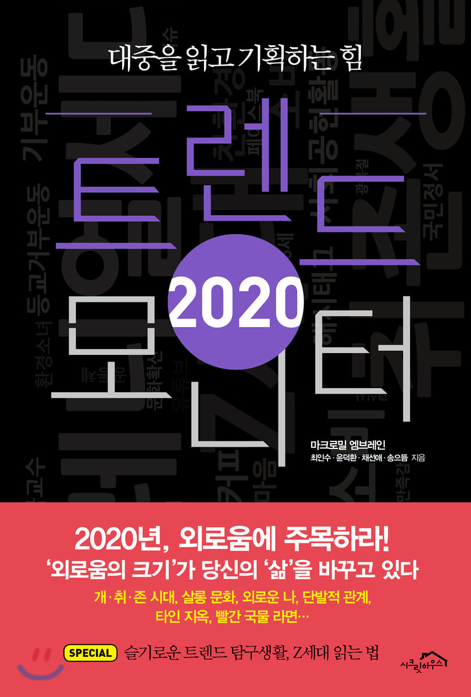

### 2020 트랜드 모니터
이번 책은 독서모임에서 선정된 읽게 되었다. 개인적으로 트랜드 분석하는 책에 흥미를 느끼지 못하는 편이다. 다소 시니컬하다보니 이번 책도 나에게는 많은 즐거움을 제공해주지는 못했다. 우선, 책을 읽으면서 궁금했던 점은 우리나라의 인구수가 약 5천만명은 되는데 왜 표본의 수를 1,000명을 기준으로 하는 걸까에 대한 의문이다. 1,000명으로 과연 얼마나 유의미한 데이터를 얻을 수 있을까 하는 의문이 들었다. 더군다나 엠브레인 회사 같은 경우 트랜드를 조사하는 회사인 것 같은데.. 표본 수를 왜이렇게 작게해서 마치 일반관념들이 그런거 같다라고 추론하는지 조금 의문이 들었다. 공학적 관점을 소지하고 있어서 굉장히 숫자를 예민하게 본 것일 수도 있다. 다만, 이렇게 작은 수로 일반화를 시키면 잘못된 데이터가 유입돼 사람들에게 이상한 관점을 심어줄 수도 있다는 생각이 든다. 비판적인 견해는 앞과 같지만, 그래도 개인주의적인 성향에 대해 잘 풀어낸 것 같아서 좋았다. 최근에 화두가 되는 Z 세대에 대해 이야기를 해서 좋았던 것 같다. Z세대의 가장 핵심적인 요소는 "주체는 나이다." 라는 것이다. 최근에는 아웃사이더 인사이더를 넘어 마사이더 라는 개념까지 등장할 정도로 개인주의적 성향이 강해지고 있다.

책을 읽으면서 왜이렇게 개인주의적 성향이 강해졌을까 고민해보았다. 전문가가 아니라 두 가지 정도 생각이 떠올랐는데, 첫 번째 생각은 IT기술의 발달인 것 같다. IT 기술의 발달로 무차별한 정보들을 마주하게 되는 상황에 직면했다고 생각한다. 개인주의적인 관점도 하나의 정보로 들어왔을 것이며, 우리가 이제까지 살아온 성향과 다름에 끌렸을 것이라고 추측해본다. 두 번째 생각은 기성세대에 대한 불만인 것 같다. 현재 사회현상 즉, 불공정 미친 집 값 꼰대 등등 다양한 불만들을 야기시키는 현상들이 존재한다. 이런 현상들을 기성세대들이 만들었다는 불만이 내포되어있는 것 아닌가 하는 생각도 든다. 지극히 본인 생각으로 다른 생각을 가진 사람이 있을 것이다. 다만 중요한 본질은 현재 우리의 젊은 세대들은 개인주의적 성향이 강하다는 사실이다.

개인주의적 성향이 강할 경우 어떤 문제가 발생하는지 많이 고민해보았다. 개인적 견해는 여기에 풀지 않으려 한다. :) 개인주의 성향은 어떻게 보면 되게 좋은 것이라 생각한다. 내 주변 사람들 나의 성장만 고려하면 되고 다른 이슈에 대해서는 생각할 필요가 없기 때문에 에너지(?) 측면에서도 도움이 된다. 다만, 많은 문제가 파생될 것이라고 생각된다. 이런 부분들을 다 같이 생각해보고 이야기를 나누면 재밌을 것 같다.

### 책을 읽고 좋았던 점
책을 읽고 독서모임을 하면서 파생되었던 재미난 토론 주제를 던져본다.

- 일본의 불매운동에 대해 어떻게 생각하는가?

- 연예인은 공인인가?

- 노키즈존에 대해 어떻게 생각하는가?

{: width="130" height="220" .center-image}
