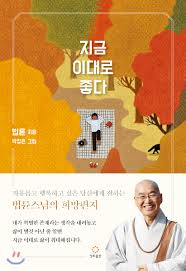

### 지금 이대로 좋다
 힐링에세이 책을 최근들어 읽은 적이 없는 것 같다는 생각이 들었다. 책을 완독하고 싶다는 생각과 빠르게 읽고 관점을 새롭게 하고 싶다는 생각에 읽었다. 재밌었던 점은 스님은 "행복" 이라는 도서를 썼을 때 관점이 변함없고 욕심을 버리라는 철학(불심?)도 굳건했다는 생각이 들었다. 스님의 행보를 지켜봤을 때 많은 것을 얻었을 것 같다는 생각이 들었는데 흔들림 없이 자신의 길을 뚜벅뚜벅 걸어가는 모습에 다시 한번 감명받았다. 다람쥐 이야기는 어김없이 이번 책에서도 등장했다. 다람쥐 같은 삶을 나는 살고 있는가? 하는 생각이 들었다. 주어진 문제에 초점을 맞추고 더도 말고 덜도 말고 문제에만 몰입해서 해결하고 있는가? 아직 많이 부족하다는 생각이 들었다. 이번 책을 계기로 몰입에 대해 좀 더 할 수 있도록 해봐야겠다는 생각을 했다.

### 책을 읽고 좋았던 점
> '나는 생각한다 고로 존재한다' 그렇지 않습니다. 존재가 우선입니다. 생각하기 전에 이미 존재하고 있고 이미 살고있다는 말이에요. '왜'가 아니라 '어떻게' 입니다. 이미살고 있는데 즐겁게 살 건지, 괴롭게 살 건지, 그건 나의 선택입니다. 아침에 눈 떠서 살아 있으면 '오늘은 어떻게 살면 좋을까'하고 생각해 보세요.

- 왜 사는 것보다 하루를 어떻게 하면 기분 좋게 만족하면서 살 수 있을까에 초점을 맞추는 것이 중요한 것 같다. 왜 나는 안되지가 아니라 어떻게 하면 내가 이 일을 해결할 수 있을까?? 에 초점을 맞추는 것과 같이.. 중요한 관점인 것 같다.

> 스펙보다는 경험이 우선입니다. 아파본 사람이 의사가 되고 불이익을 당해 본 사람이 변호사가 된다면 환자나 의뢰인의 고충을 가장 잘 아는 사람이 되겠지요. 어려움 없이 좋은 대학 진학해서 원하는 직업 갖는 게 좋은 일만은 아닙니다. 사회에 나가 버팀목이 되는 힘은 좋은 성적이나 대학이 아니라 어려움을 겪어낸 경험입니다.

- 지금 시기가 취업이 어려운 것에 대해 공감한다. 취직을 하지 못한 상황에 처하지 않은 상황에서 왈가왈부 하는 것은 옳지 못한 일이지만, 스님의 말에 비춰 봤을 때 또, 본인의 생각을 덧붙여 생각해보면, 경험 > 스펙을 이긴다는 맞는 것 같다는 생각이 든다. 다만, 이런 경험들을 잘 엮어 하나의 스토리로 만드는 것도 중요한 능력이라는 생각이 든다.

> 공부는 자기 필요에 의해서 해야 문리가 터지고 통찰력이 생깁니다.

- 자기 필요를 어떻게 하면 좋을까에 초점을 맞춰보길,, e.g. 누군가에 의해 공부 억제를 당하는 상황. (군대..?)

> 자존감이 떨어지는 이유는 나의 존재가 다른 사람보다 못해서가 아니라 환상속의 자신을 너무 높게 평가해서 그래요. 자존감을 회복하는 방법은 나의 능력을 키우는게 아니라 환상 속의 나를 버리는 거에요. 그러고 보면 나는 지금 이대로도 충분하고 괜찮아요.

- 주체를 나로 잡고 비교를 하지 않는 삶이 얼마나 중요한 지 다시 한번 생각해볼 수 있는 것 같았다. 아직은 부족한 점이 많으나 환상 속의 나를 많이 버리려 하는 편인 것 같다.

> 오늘 살아있음에 감사하고, 일할 곳이 있음에 감사하고, 지금 나에게 만족하면 지금 내가 특별한 존재가 되고 오늘이 특별한 날이 됩니다. 특별해야 한다는 생각을 할수록 인생은 괴로워집니다. 특별한 날이 따로 없다는 것을 알면 비로소 특별한 날을 만나게 됩니다.

- 감사하면 알게되는 것들.

> 살아 있는 것만으로 기뻐하면 다른 건 별로 중요하지 않아요, 병이 나면 '건강만 하면 참 좋겠다' 눈을 다치면 '눈만 보여도 좋겠다' 두 다리를 못 쓰게 되면 '걷기만 해도 좋겠다'하죠. 이렇게 행복은 지천에 깔려 있어요. 그런데 그걸 다 내팽개치고 욕심에 눈이 어두워서 다른 데서 행복을 찾아다닙니다. 그러다 죽을 때까지 행복하지 못할 수 가 있어요. 그러니 지금 행복하세요.

- 사람이 참 간사하다는 생각이 들었다. 내 앞에 직면한 문제에 대해서만 크게 생각한다. 현재 내가 가진 것들에 대한 장점은 고려하지 못하는 것 같다. 이건 물건에서도 똑같다는 생각이 들었다. 내가 지금 가지고 있는 컴퓨터, 옷 이전에 내가 사기 전 동일한 마음을 갖고 샀을 것인데.. 그걸 잘 인지 못하고 망각한다는 생각이 들었다. 이런 사소한 물건에서 부터 차근차근 연습해보자 라는 생각이 들었다.

{: width="130" height="220" .center-image}
